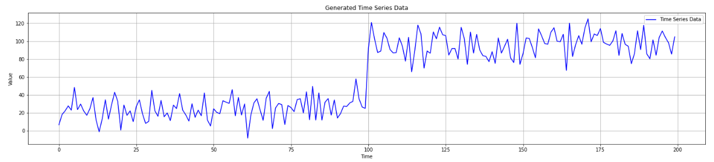
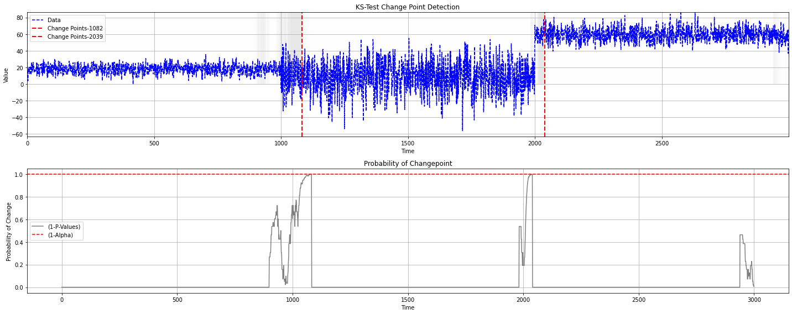

[](https://github.com/giobbu/CUSUM/actions/workflows/python-tests.yml)

[](https://doi.org/10.5281/zenodo.14052654)
[](https://CUSUM.readthedocs.io/en/latest/)


# **Change Point Detection**

A change point refers to a moment in time when the statistical properties of a target variable or data distribution shift. Detecting these changes is essential in domains such as finance, energy markets, healthcare, environmental monitoring, industrial processes, and online advertising, where models and decisions must continually adapt to evolving conditions. 

### Example — Monitoring performance degradation of a learning model in a production setting
Model drift refers to the degradation of machine learning model performance due to changes in data or in the relationships between input and output variables.

#### Generate data
Use a data generator to create time-series data that includes an abrupt mean shift.



#### Simulating Streaming Data
**Simulate a streaming scenario by iterating through a sequence of observations. At each step:**

1. Generate a prediction with recursive least squares (RLS) model.
2. Retrieve the true observed value.
3. Update the model parameters with the new data instance.
4. Compute residual.
5. Apply the CUSUM detector on the residuals to identify potential change points.

Check out the notebook [HERE](https://github.com/giobbu/CUSUM/blob/main/notebooks/example_ml_monitoring.ipynb)


## **Change Point Detectors**

Change point detectors are algorithms designed to detect change points in streaming data or sequential observations. These detectors analyze the data stream and identify points where the underlying data distribution has changed significantly.

### **Generate Data with Mean Shift**
```python 

from source.generator.change_point_generator import ChangePointGenerator
from source.detector.cusum import CUSUM_Detector, ProbCUSUM_Detector, ChartCUSUM_Detector,KS_CUM_Detector

# Generate time series data with change points
generator = ChangePointGenerator(num_segments=3, 
                                segment_length=1000, 
                                change_point_type='sudden_shift', 
                                seed=12)  # set seed for reproducibility
generator.generate_data()
# Plot the generated data
generator.plot_data()
```

## **Drift Detectors**

Change point detection algorithms can be applied to both data batches, **offline detection**, and individual data instances, **online detection**. The algorithms implemented here are suitable for use in both settings.

### **1. CUSUM Detector (Page-Hinkley test)**

The CUSUM detector monitors the cumulative sum of deviations between observed data points and a reference value. When the cumulative sum exceeds a predefined threshold, it signals the presence of a change point.

```python 
# Detect change points using CUSUM Detector
cusum_detector = CUSUM_Detector(warmup_period=500, delta=3, threshold=10)
```

#### Online Detection
```python 
for data in generator.data:
    pos, neg, is_change = cusum_detector.detection(data)
    print(f"Change Detected: {is_change} \n -Positives: {pos[0]}, \n -Negatives: {neg[0]}")
```

#### Offline Detection
```python 
# Detect change points using CUSUM Detector
results = cusum_detector.offline_detection(generator.data)

# Plot the detected change points using CUSUM Detector
cusum_detector.plot_change_points(generator.data, 
                                results["change_points"], 
                                results["pos_changes"], 
                                results["neg_changes"])
```


### **2. Probabilistic CUSUM Detector**

The Probabilistic CUSUM detector extends the CUSUM method by incorporating probability. It evaluates the probability of observing deviations between data points, making it more robust to variations in data distribution.

```python 
# Detect change points using Probabilistic CUSUM Detector
prob_cusum_detector = ProbCUSUM_Detector(warmup_period=500, threshold_probability=0.01)
```

#### Online Detection
```python 
for data in generator.data:
    prob_change, is_change = prob_cusum_detector.detection(data)
    print(f"Change Detected: {is_change}\n -with Probability: {prob_change}")
```

#### Offline Detection
```python 
results = prob_cusum_detector.offline_detection(generator.data)

# Plot the detected change points using Probabilistic CUSUM Detector
prob_cusum_detector.plot_change_points(generator.data, 
                                       results["change_points"], 
                                       results["probabilities"])
```


### **Extensions: 3. CUSUM Control Chart Detector**

The CUSUM Control Chart uses cumulative sums of deviations from a know target or reference mean. Designed for Statistical Process Control (SPC), Control Chart are primarily used in industrial quality control.

### **3.1 CUSUM Control Chart of Deviations**

```python 
# Detect change points using Control Chart CUSUM Detector
chart_cusum_detector = ChartCUSUM_Detector(warmup_period=500, level=3, deviation_type='dev')
```

#### Online Detection
```python 
for data in generator.data:
    ucl, lcl, value, is_change = chart_cusum_detector.detection(data)
    print(f"Change Detected: {is_change}\n -UCL: {ucl}, \n -LCL: {lcl}, \n -CUSUM Value: {value}")
```

#### Offline Detection
```python
results = chart_cusum_detector.offline_detection(generator.data)

# Plot the detected change points using Control Chart CUSUM Detector
chart_cusum_detector.plot_change_points(generator.data, 
                                        results["change_points"], 
                                        results["cusums"], 
                                        results["upper_limits"], 
                                        results["lower_limits"])
```


### **3.2 CUSUM Control Chart of Squares**

```python 
# Detect change points using Control Chart CUSUM Detector
chart_cusum_detector = ChartCUSUM_Detector(warmup_period=500, level=3, deviation_type='sqr-dev')
```

#### Online Detection
```python 
for data in generator.data:
    ucl, lcl, value, is_change = chart_cusum_detector.detection(data)
    print(f"Change Detected: {is_change}\n -UCL: {ucl}, \n -LCL: {lcl}, \n -CUSUM Value: {value}")
```

#### Offline Detection
```python 
results = chart_cusum_detector.offline_detection(generator.data)

# Plot the detected change points using Control Chart CUSUM Detector
chart_cusum_detector.plot_change_points(generator.data,
                                        results["change_points"], 
                                        results["cusums"], 
                                        results["upper_limits"], 
                                        results["lower_limits"])
```


### **Extensions: KS-CUM Detector - Kolmogorov-Smirnov Test**

```python 
# Kolmogorov-Smirnov Test
ks_detector = KS_CUM_Detector(window_pre=600, window_post=300, alpha=0.001)
```

#### Online Detection
```python 
for data in generator.data:
    ks_statistic, p_value, is_change = ks_detector.detection(data)
    print(f"Change Detected: {is_change}\n -KS Statistic: {ks_statistic}, \n -P-Value: {p_value}")
```

#### Offline Detection
```python 
results = ks_detector.offline_detection(generator.data)

# Plot the detected change points using KS Detector
ks_detector.plot_change_points(generator.data, 
                                results['change_points'], 
                                results['p_values'])
```




 
