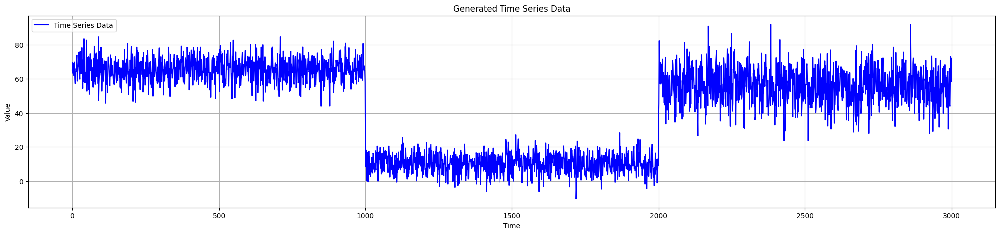
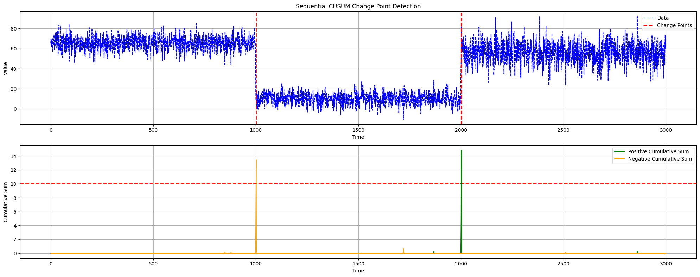
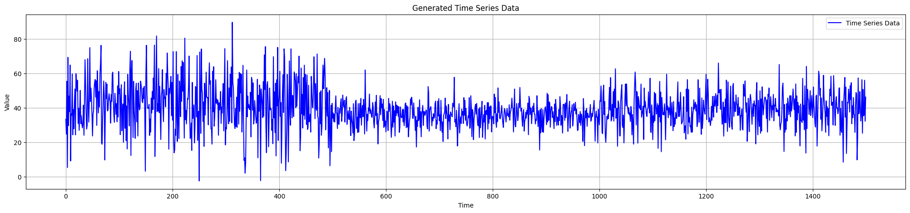
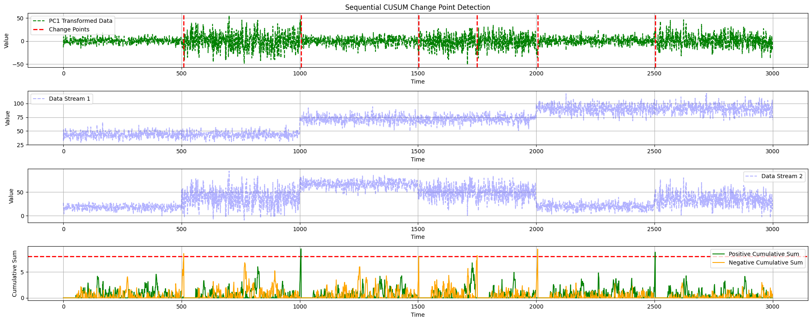
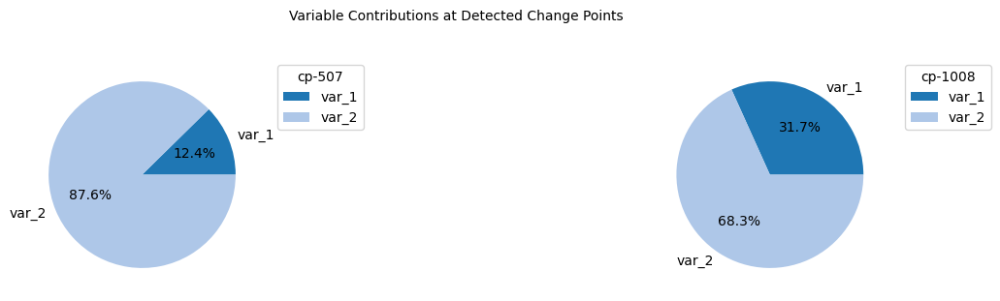

[](https://www.python.org/downloads/)
[](https://github.com/giobbu/CUSUM/actions/workflows/ci.yml)
[](https://codecov.io/gh/giobbu/CUSUM)

[](https://doi.org/10.5281/zenodo.14052654)

# CUSUM

The CUSUM repository contains multiple change point detectors for sequential analysis, enabling the detection of changes in the statistical properties of time-ordered or streaming data.

## Table of Contents

0. [Overview](#0-overview)
1. [CUSUM Detectors](#1-cusum-detectors)
2. [Getting Started](#2-getting-started)
3. [Documentation](#3-documentation)
4. [Examples](#4-examples)
    * 4.1. [Univariate Case](#41-univariate-case)
    * 4.2. [Multivariate Case](#42-multivariate-case)
    * 4.3. [ML Performance Monitoring](#43-ml-performance-monitoring)
5. [License](#5-license)

## 0. Overview

A change point is a moment in time at which the statistical properties of a target variable or its underlying data distribution change. Detecting such shifts is critical in domains such as finance, energy markets, healthcare, environmental monitoring, industrial processes, and online advertising, where models and decision-making systems must continuously adapt to evolving conditions.

This project implements several variants of the CUSUM (Cumulative Sum) algorithm for change point detection.

## 1. CUSUM Detectors

CUSUM detectors are sequential algorithms designed to identify change points in time-ordered or streaming data. They process observations incrementally and signal a change when evidence suggests a significant deviation from the expected data distribution.

The implemented algorithms support both:

* **Batch-based detection**, where change points are identified over fixed data windows or batches

* **Instance-based detection**, where each observation is evaluated individually as it arrives

These detectors are therefore suitable for both offline analysis and real-time monitoring scenarios.

## 2. Getting Started

### Installation

Clone the repository:

```bash
git clone https://github.com/giobbu/CUSUM.git
cd CUSUM
```
 and install dependencies:
```bash
uv sync
```

## 3. Documentation
[](https://CUSUM.readthedocs.io/en/latest/)

Documentation is available at [CUSUM Documentation](https://CUSUM.readthedocs.io/en/latest/)


## 4. Examples

The CUSUM detector monitors the cumulative sum of deviations between observed data points and a reference value. When the cumulative sum exceeds a predefined threshold, it signals the presence of a change point.

### 4.1 Univariate Case

#### Generate Data
```python
from source.generator.change_point_generator import ChangePointGenerator

# Generate time series data with change points
generator = ChangePointGenerator(num_segments=3, 
                                 segment_length=1000, 
                                 change_point_type='sudden_shift', 
                                 seed=2)
generator.generate_data()
data_stream = generator.get_data()
```



#### Vanilla CUSUM Detector
```python 
from source.detector.cusum import CUSUM_Detector

# Detect change points using CUSUM Detector
cusum_detector = CUSUM_Detector(warmup_period=500, delta=3, threshold=10)
```

#### a. Instance-based Detection
```python
for data in data_stream:
    pos, neg, is_change = cusum_detector.detection(data)
    print(f"Change Detected: {is_change} \n -Positives: {pos[0]}, \n -Negatives: {neg[0]}")
```

#### b. Batch-based Detection
```python 
# Detect change points using CUSUM Detector
results = cusum_detector.offline_detection(data_stream)

# Plot the detected change points using CUSUM Detector
cusum_detector.plot_change_points(data_stream, 
                                results["change_points"], 
                                results["pos_changes"], 
                                results["neg_changes"])
```



### 4.2 Multivariate Case

##### Generate multiple data streams
```python 
from source.generator.ds_generator import MultiDataStreams

# Generate Two Data Streams
dict_streams = [{"num_segments": 3,
                 "segment_length": 1000,
                 "change_point_type": "sudden_shift",
                    "seed": 2},
                {"num_segments": 6,
                    "segment_length": 500,
                    "change_point_type": "sudden_shift",
                    "seed": 11}]
                    
# Initialize Data Streams Generator
many_data_streams = MultiDataStreams(dict_streams=dict_streams)
many_data_streams.generate_data_streams()
# Get Data Streams as Array
data_streams_arr = many_data_streams.get_data_streams_as_array()
```



##### Apply PC1-based CUSUM detector
```python 
from source.detector.cusum import PC1_CUSUM_Detector

# Initialize PC1-CUSUM Detector
pc1_detector = PC1_CUSUM_Detector(warmup_period=50, delta=0.5, threshold=8)
# Offline Detection
results = pc1_detector.offline_detection(data_streams_arr)
# Plot Change Points
pc1_detector.plot_change_points(data_streams=data_streams_arr,
                                    pos_changes=results['pos_changes'], 
                                    neg_changes=results['neg_changes'], 
                                    change_points=results['change_points'])
```


##### **Diagnostic**: Plot variable contributions
```python 
# get contributions
list_contributions = pc1_detector.get_contributions()
# plot pie charts
pc1_detector.plot_contributions(list_contributions=list_contributions)
```


### 4.3 ML Performance Monitoring

Performance Monitoring of an instance-based ML model applying the CUSUM algorithm.
For each time step:

* Generate a prediction with recursive least squares (RLS) model;
* Retrieve the true observed value;
* Compute residual;
* Apply the CUSUM detector on the residuals to identify potential change points;
* Update the model parameters with the new data instance.


## 5. License
This project is licensed under the GPL-3.0 license - see the [LICENSE](https://github.com/giobbu/CUSUM?tab=GPL-3.0-1-ov-file) file for details.


