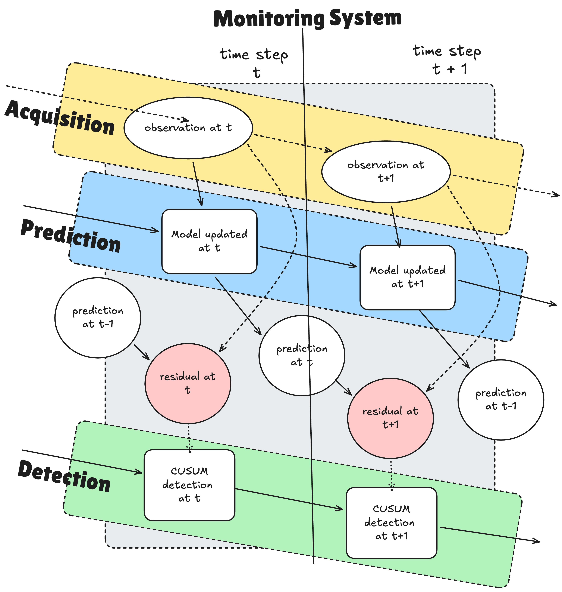

[](https://www.python.org/downloads/)
[](https://CUSUM.readthedocs.io/en/latest/)
[](https://github.com/giobbu/CUSUM/actions/workflows/ci.yml)
[](https://codecov.io/gh/giobbu/CUSUM)

[](https://doi.org/10.5281/zenodo.14052654)


# CUSUM


The CUSUM repository contains multiple change point detectors for sequential analysis, enabling the detection of changes in the statistical properties of time-ordered or streaming data.

## Table of Contents

0. [Overview](#0-overview)
1. [CUSUM Detectors](#1-cusum-detectors)
2. [Setup](#2-setup)
3. [Quickstart](#3-quickstart)
4. [Documentation](#4-documentation)
5. [Examples](#5-examples)
6. [License](#6-license)

## 0. Overview

A change point is a point in time at which the statistical properties of a target variable—or its underlying data-generating process—undergo a significant shift. Detecting such changes is critical in domains such as finance, energy markets, healthcare, environmental monitoring, industrial processes, and online advertising. In these settings, predictive models and decision-making systems must adapt continuously to non-stationary and evolving conditions.

This project implements multiple variants of the CUSUM algorithm for change point detection, enabling robust identification of distributional shifts in sequential data.

## 1. CUSUM Detectors

CUSUM-based detectors are sequential algorithms designed to identify shifts in time-ordered or streaming data. They operate by incrementally processing observations—either instance by instance or in batches—and signaling a change when accumulated evidence indicates a statistically significant deviation from the expected behavior.

The implemented detectors support both:

* **Batch-based detection**, where change points are identified over fixed-size windows or data batches

* **Instance-based detection**, where each incoming observation is evaluated upon arrival

These detectors are, therefore, well suitable for both offline analysis and real-time monitoring in streaming environmnets.

## 2. Setup

Clone the repository:

```bash
git clone https://github.com/giobbu/CUSUM.git
cd CUSUM
```

### Using Makefile (Recommended)

The repository includes a Makefile for easy setup and common tasks:

```bash
# Install dependencies using uv sync
make install

# Run tests with coverage
make test

# Upgrade a specific package
make upgrade PACKAGE=<package-name>

# View all available commands
make help
```

### Manual Setup

Alternatively, set up manually using uv:

```bash
# Install dependencies
uv sync

# Run tests
pytest --cov=source test/
```

## 3. Quickstart

```python
from source.generator.change_point_generator import ChangePointGenerator
from source.detector.cusum import CUSUM_Detector

# config Data Generator
NUM_SEGM = 3
LEN_SEGM = 1000
TYPE_CHANGE = "sudden_shift"
SEED = 42

# Generate time series data with change points
generator = ChangePointGenerator(num_segments=NUM_SEGM, 
                                 segment_length=LEN_SEGM, 
                                 change_point_type=TYPE_CHANGE, 
                                 seed=SEED)
generator.generate_data()

# config CUSUM Detector
WARMUP = 500
DELTA = 3
THRESHOLD = 1

# CUSUM Detector init and run
cusum_detector = CUSUM_Detector(warmup_period=WARMUP, delta=DELTA, threshold=THRESHOLD)
results = cusum_detector.offline_detection(generator.data)

# Plot the detected change points
cusum_detector.plot_change_points(generator.data, 
                                  results["change_points"], 
                                  results["pos_changes"], 
                                  results["neg_changes"]) 
```


## 4. Documentation

Documentation is available at [CUSUM Documentation](https://CUSUM.readthedocs.io/en/latest/)

## 5. Examples

### A. Probabilistic CUSUM detector

View details on docs - [Here](https://cusum.readthedocs.io/en/latest/tech_doc/detector/cusum/prob_cusum.html)


### B. RLS-CUSUM for streaming monitoring

RLS-CUSUM based Monitoring with an instance-based linear learning model and the CUSUM detector.




At each time step: 

* Generate a prediction with recursive least squares (RLS) model;
* Acquire the true observed value;
* Compute residual;
* Apply the CUSUM detector on the residuals to identify potential change points;
* Update the model parameters with the new data instance.

View details on notebook - [Here](notebooks/notebook_rls_monitoring.ipynb)


### C. CUSUM-Ops

* Event-based CUSUM detection with Kafka, Prometheus and Grafana in [mlops-kafka](https://github.com/giobbu/CUSUM/tree/main/mlops-kafka)
* Scheduled CUSUM detection with Kubernetes CronJob and minikube local cluster in [mlops-cronjob](https://github.com/giobbu/CUSUM/tree/main/mlops-cronjob)

## 6. License
This project is under the [GPL-3.0 license](https://github.com/giobbu/CUSUM?tab=GPL-3.0-1-ov-file).


