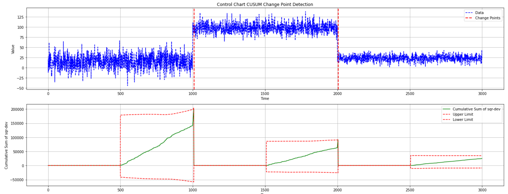

[](https://github.com/giobbu/CUSUM/actions/workflows/python-tests.yml)

[](https://doi.org/10.5281/zenodo.14052654)

# **Change Point Detection**

A change point refers to a moment in time when the statistical properties of a target variable or data distribution shift. Detecting these changes is essential in domains such as finance, energy markets, healthcare, environmental monitoring, industrial processes, and online advertising, where models and decisions must continually adapt to evolving conditions. 

### Example — Monitoring performance degradation of a learning model in a production setting
Model drift refers to the degradation of machine learning model performance due to changes in data or in the relationships between input and output variables.

#### Generate data
Use a data generator to create time-series data that includes an abrupt mean shift.


#### Simulating Streaming Data
**Simulate a streaming scenario by iterating through a sequence of observations. At each step:**
1. Generate a prediction with recursive least squares (RLS) model.
2. Retrieve the true observed value.
3. Update the model parameters with the new data instance.
4. Compute residual.
5. Apply the CUSUM detector on the residuals to identify potential change points.


## **Change Point Detectors**

Change point detectors are algorithms designed to detect change points in streaming data or sequential observations. These detectors analyze the data stream and identify points where the underlying data distribution has changed significantly.

### **Generate Data with Mean Shift**
```python 
import numpy as np
from source.generator.change_point_generator import ChangePointGenerator
from source.detector.cusum import CUSUM_Detector, ProbCUSUM_Detector, ChartCUSUM_Detector

# Generate time series data with change points
generator = ChangePointGenerator(num_segments=3, 
                                segment_length=1000, 
                                change_point_type='sudden_shift', 
                                seed=12)  # set seed for reproducibility
generator.generate_data()
# Plot the generated data
generator.plot_data()
```

## **Drift Detectors**

Change point detection algorithms can be applied to both data batches, **offline detection**, and individual data instances, **online detection**. The algorithms implemented here are suitable for use in both settings.

### **1. CUSUM Detector (The PageHinkley Algorithm)**

The CUSUM detector monitors the cumulative sum of deviations between observed data points and a reference value. When the cumulative sum exceeds a predefined threshold, it signals the presence of a change point.

```python 
# Detect change points using CUSUM Detector
cusum_detector = CUSUM_Detector(warmup_period=500, delta=3, threshold=10)
```

#### Offline Detection
```python 
# Detect change points using CUSUM Detector
cusum_pos_changes, cusum_neg_changes, cusum_change_points = cusum_detector.detect_change_points(np.array(generator.data))
```

```python 
# Plot the detected change points using CUSUM Detector
cusum_detector.plot_change_points(generator.data, cusum_change_points, cusum_pos_changes, cusum_neg_changes)
```


### **2. Probabilistic CUSUM Detector**

The Probabilistic CUSUM detector extends the CUSUM method by incorporating statistical probability measures. It evaluates the probability of observing deviations between data points, making it more robust to variations in data distribution.

```python 
# Detect change points using Probabilistic CUSUM Detector
prob_cusum_detector = ProbCUSUM_Detector(warmup_period=500, threshold_probability=0.01)
prob_probabilities, prob_change_points = prob_cusum_detector.detect_change_points(np.array(generator.data))
# Plot the detected change points using Probabilistic CUSUM Detector
prob_cusum_detector.plot_change_points(generator.data, prob_change_points, prob_probabilities)
```


### **3. CUSUM Control Chart Detector**

The Control Chart CUSUM detector is a specialized form of CUSUM change point detection algorithm commonly used in quality control and process monitoring applications.

### **3.1 CUSUM of Deviations**

```python 
# Detect change points using Control Chart CUSUM Detector
chart_cusum_detector = ChartCUSUM_Detector(warmup_period=500, level=3, deviation_type='dev')
upper_limits, lower_limits, cusums, change_points = chart_cusum_detector.detect_change_points(np.array(generator.data))
# Plot the detected change points using Control Chart CUSUM Detector
chart_cusum_detector.plot_change_points(np.array(generator.data), change_points, cusums, upper_limits, lower_limits)
```


### **3.2 CUSUM of Squares**

```python 
# Detect change points using Control Chart CUSUM Detector
chart_cusum_detector = ChartCUSUM_Detector(warmup_period=500, level=3, deviation_type='sqr-dev')
upper_limits, lower_limits, cusums, change_points = chart_cusum_detector.detect_change_points(np.array(generator.data))

# Plot the detected change points using Control Chart CUSUM Detector
chart_cusum_detector.plot_change_points(np.array(generator.data), change_points, cusums, upper_limits, lower_limits)
```




### **Extensions: KS-CUM Detector (Kolmogorov-Smirnov Test)**

```python 

import numpy as np
from source.generator.change_point_generator import ChangePointGenerator
from source.detector.cusum import KS_CUM_Detector

# Set seed
np.random.seed(11)

# Generate time series data with change points
generator = ChangePointGenerator(num_segments=3, segment_length=1000, change_point_type='sudden_shift')
generator.generate_data()
# Plot the generated data
generator.plot_data()

# Kolmogorov-Smirnov Test
ks_detector = KS_CUM_Detector(window_pre=600, window_post=300, alpha=0.001)
ks_statistics , p_values, change_points = ks_detector.detect_change_points(np.array(generator.data))
ks_detector.plot_change_points(generator.data, change_points, p_values)
```


 
