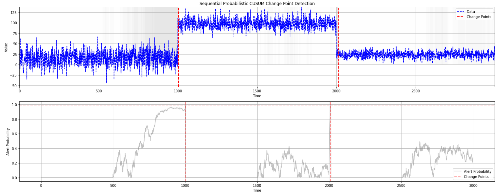

# **Change Point Detection**

Change point refers to the phenomenon where the statistical properties of a target variable or data distribution change over time. Detecting change point is crucial in various domains such as financial markets, healthcare, and online advertising to adapt models and decision-making processes to changing environments.

## **Change Point Detectors**

Change point detectors are algorithms designed to detect change points in streaming data or sequential observations. These detectors analyze the data stream and identify points where the underlying data distribution has changed significantly.

### **Generate Data with Mean Shift**
```python 
import numpy as np
from source.generator.change_point_generator import ChangePointGenerator
from source.detector.cusum import CUSUM_Detector, ProbCUSUM_Detector, ChartCUSUM_Detector

# set seed
np.random.seed(12)

# Generate time series data with change points
generator = ChangePointGenerator(num_segments=3, segment_length=1000, change_point_type='sudden_shift')
generator.generate_data()

# Plot the generated data
generator.plot_data()
```

## **Three commonly used drift detectors are:**

### **1. CUSUM Detector (The PageHinkley Algorithm)**

The CUSUM detector monitors the cumulative sum of deviations between observed data points and a reference value. When the cumulative sum exceeds a predefined threshold, it signals the presence of a change point.

```python 
# Detect change points using CUSUM Detector
cusum_detector = CUSUM_Detector(warmup_period=500, delta=3, threshold=10)
cusum_pos_changes, cusum_neg_changes, cusum_change_points = cusum_detector.detect_change_points(np.array(generator.data))

# Plot the detected change points using CUSUM Detector
cusum_detector.plot_change_points(generator.data, cusum_change_points, cusum_pos_changes, cusum_neg_changes)
```


### **2. Probabilistic CUSUM Detector**

The Probabilistic CUSUM detector extends the CUSUM method by incorporating statistical probability measures. It evaluates the probability of observing deviations between data points, making it more robust to variations in data distribution.

```python 
# Detect change points using Probabilistic CUSUM Detector
prob_cusum_detector = ProbCUSUM_Detector(warmup_period=500, threshold_probability=0.01)
prob_probabilities, prob_change_points = prob_cusum_detector.detect_change_points(np.array(generator.data))

# Plot the detected change points using Probabilistic CUSUM Detector
prob_cusum_detector.plot_change_points(generator.data, prob_change_points, prob_probabilities)
```




### **3. CUSUM Control Chart Detector**

The Control Chart CUSUM detector is a specialized form of CUSUM change point detection algorithm commonly used in quality control and process monitoring applications.

### **3.1 CUSUM of Deviations**

```python 
# Detect change points using Control Chart CUSUM Detector
chart_cusum_detector = ChartCUSUM_Detector(warmup_period=500, level=3, deviation_type='dev')
upper_limits, lower_limits, cusums, change_points = chart_cusum_detector.detect_change_points(np.array(generator.data))

# Plot the detected change points using Control Chart CUSUM Detector
chart_cusum_detector.plot_change_points(np.array(generator.data), change_points, cusums, upper_limits, lower_limits)
```


### **3.2 CUSUM of Squares**

```python 
# Detect change points using Control Chart CUSUM Detector
chart_cusum_detector = ChartCUSUM_Detector(warmup_period=500, level=3, deviation_type='sqr-dev')
upper_limits, lower_limits, cusums, change_points = chart_cusum_detector.detect_change_points(np.array(generator.data))

# Plot the detected change points using Control Chart CUSUM Detector
chart_cusum_detector.plot_change_points(np.array(generator.data), change_points, cusums, upper_limits, lower_limits)
```


 
## Monitoring model drift

