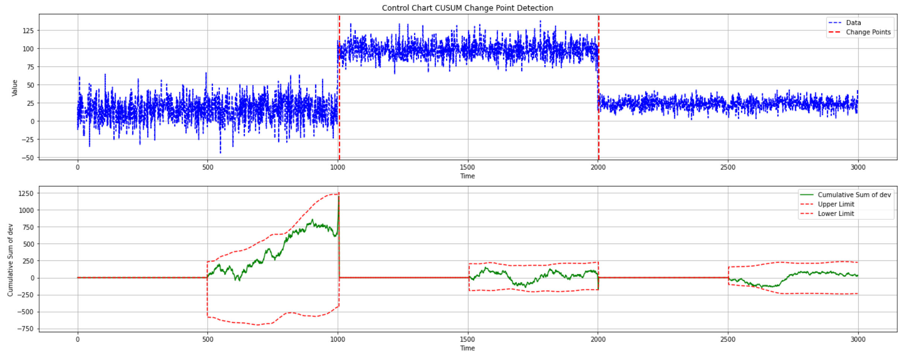

Chart CUSUM Detector
--------------------

.. autoclass:: source.detector.cusum.ChartCUSUM_Detector
   :members:
   :undoc-members:
   :show-inheritance:
   :special-members: __init__

Examples 
--------

**Online Detection**

.. code-block:: python

    from source.detector.cusum import ChartCUSUM_Detector

    detector = ChartCUSUM_Detector(warmup_period=20, level=3, deviation_type='sqr-dev')
    data_stream = np.concatenate([np.random.normal(0, 1, 100),
                        np.random.normal(5, 1, 100)])
    for data in data_stream:
        cusum, upper_limit, lower_limit, is_change = detector.detection(data)
        print(f"Change Detected: {is_change} \n -CUSUM: {cusum[0]}, \n -Upper Limit: {upper_limit[0]}, \n -Lower Limit: {lower_limit[0]}")

**Offline Detection**

.. code-block:: python

    from source.detector.cusum import ChartCUSUM_Detector

    detector = ChartCUSUM_Detector(warmup_period=20, level=3, deviation_type='sqr-dev')
    data = np.concatenate([np.random.normal(0, 1, 100),
                        np.random.normal(5, 1, 100)])
    results = detector.offline_detection(data)
    detector.plot_change_points(data,
                                results["change_points"],
                                results["cusums"],
                                results["upper_limits"],
                                results["lower_limits"])

**Plotting**

