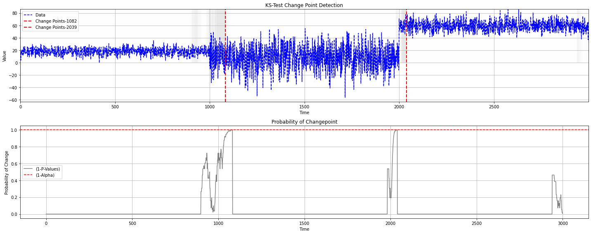

KS-CUM Detector
---------------

.. autoclass:: source.detector.cusum.KS_CUM_Detector
   :members:
   :undoc-members:
   :show-inheritance:
   :special-members: __init__

Examples 
--------

**Instance-based Detection**

.. code-block:: python

    from source.detector.cusum import KS_CUM_Detector

    detector = KS_CUM_Detector(window_pre=30, window_post=30, alpha=0.05)
    data_stream = np.concatenate([np.random.normal(0, 1, 100),
                        np.random.normal(5, 1, 100)])
    for data in data_stream:
        p_value, is_change = detector.detection(data)
        print(f"Change Detected: {is_change} \n -P-Value: {p_value[0]}")

**Batch-based Detection**

.. code-block:: python

    from source.detector.cusum import KS_CUM_Detector

    detector = KS_CUM_Detector(window_pre=30, window_post=30, alpha=0.05)
    data = np.concatenate([np.random.normal(0, 1, 100),
                        np.random.normal(5, 1, 100)])
    results = detector.offline_detection(data)
    detector.plot_change_points(data,
                                results["change_points"],
                                results["p_values"])

**Plotting**

