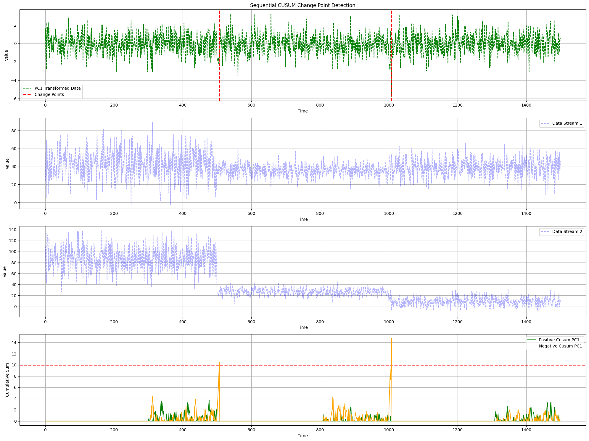

PC1 CUSUM Detector
----------------------------

.. autoclass:: source.detector.cusum.PC1_CUSUM_Detector
   :members: 
   :undoc-members:  
   :show-inheritance:
   :special-members: __init__

Example Usage
-------------

**Generate multiple data streams**

.. code-block:: python

    from source.generator.ds_generator import MultiDataStreams

    # Generate Two Data Streams
    dict_streams = [{"num_segments": 3,
                    "segment_length": 1000,
                    "change_point_type": "sudden_shift",
                        "seed": 2},
                    {"num_segments": 6,
                        "segment_length": 500,
                        "change_point_type": "sudden_shift",
                        "seed": 11}]
                        
    # Initialize Data Streams Generator
    many_data_streams = MultiDataStreams(dict_streams=dict_streams)
    many_data_streams.generate_data_streams()
    # Get Data Streams as Array
    data_streams_arr = many_data_streams.get_data_streams_as_array()

.. image:: ../../../_static/images/pc1_stream_1.png
   :alt: Data Stream 1
   :align: center
   :width: 600px

.. image:: ../../../_static/images/pc1_stream_2.png
   :alt: Data Stream 2
   :align: center
   :width: 600px

**Apply PC1-based CUSUM detector**

.. code-block:: python

    from source.detector.cusum import PC1_CUSUM_Detector

    # Initialize PC1-CUSUM Detector
    pc1_detector = PC1_CUSUM_Detector(warmup_period=50, delta=0.5, threshold=8)
    # Offline Detection
    results = pc1_detector.offline_detection(data_streams_arr)

    # Plot Change Points
    pc1_detector.plot_change_points(data_streams=data_streams_arr,
                                        pos_changes=results['pos_changes'], 
                                        neg_changes=results['neg_changes'], 
                                        change_points=results['change_points'])

**Plot Variable Contributions**

.. code-block:: python

    # get contributions
    list_contributions = pc1_detector.get_contributions()
    # plot pie charts
    pc1_detector.plot_contributions(list_contributions=list_contributions)

.. image:: ../../../_static/images/pc1_contribs.png
   :alt: Variable Contributions
   :align: center
   :width: 600px