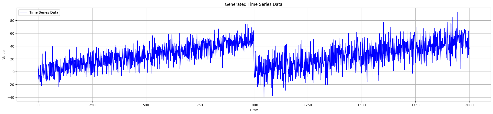
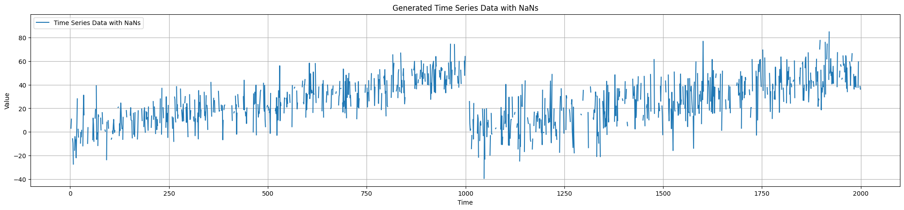
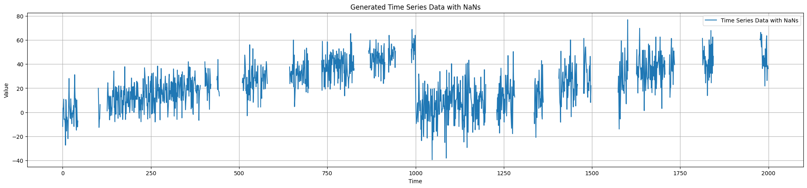

Change Point Generator
======================

This module contains the class for generating synthetic data with different types of change points.

Change Point Generator Class
----------------------------

.. autoclass:: source.generator.change_point_generator.ChangePointGenerator
   :members:
   :undoc-members:
   :show-inheritance:
   :special-members: __init__

Example Usage
-------------

**Generate Data**

.. code-block:: python

   from source.generator.change_point_generator import ChangePointGenerator

   # Initialize generator
   generator = ChangePointGenerator(num_segments=2, segment_length=1000, change_point_type='gradual_drift')

   # Generate synthetic data
   generator.generate_data()

   # Plot generated data
   generator.plot_data()

**With Point Missingness**

.. code-block:: python

   # Add point missingness
   nan_percentage = 0.25
   data_with_nans = generator.generate_point_nans(nan_percentage)

   # Plot data with missing values
   generator.plot_data_with_nans(data_with_nans)

**With Block Missingness**

.. code-block:: python

   # Add block missingness
   nan_percentage = 0.1
   min_block_size=2 
   max_block_size=50
   data_with_nans = generator.generate_block_nans(nan_percentage, min_block_size, max_block_size)

   # Plot data with missing values
   generator.plot_data_with_nans(data_with_nans)

