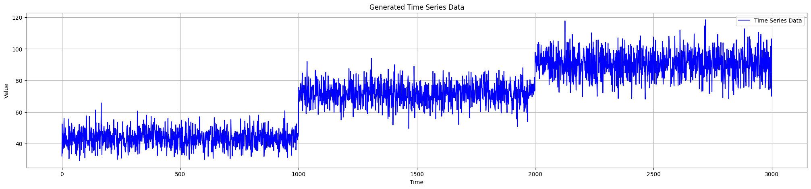
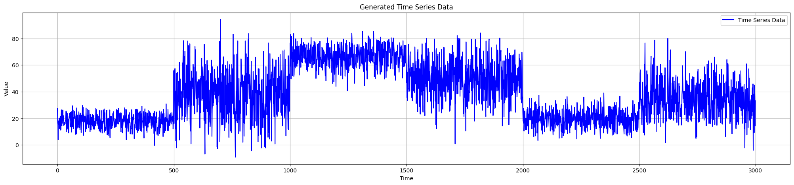

Data Streams Generator
======================

This module contains the class for generating multiple synthetic data streams with various change points.

Multiple Streams Generator Class
--------------------------------

.. autoclass:: source.generator.ds_generator.MultiDataStreams
   :members:
   :undoc-members:
   :show-inheritance:
   :special-members: __init__

Example Usage
-------------

.. code-block:: python

   from source.generator.ds_generator import MultiDataStreams

    dict_streams = [
                    {"num_segments": 3,
                    "segment_length": 1000,
                    "change_point_type": "sudden_shift",
                        "seed": 2},
                    {"num_segments": 6,
                        "segment_length": 500,
                        "change_point_type": "sudden_shift",
                        "seed": 11}
                    ]

    many_data_streams = MultiDataStreams(dict_streams=dict_streams)
    many_data_streams.generate_data_streams()
    list_data_streams = many_data_streams.get_all_streams()
    many_data_streams.plot_all_streams()
    

