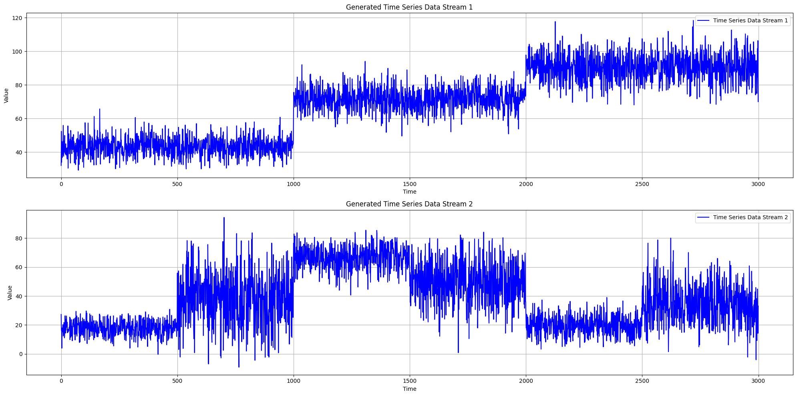
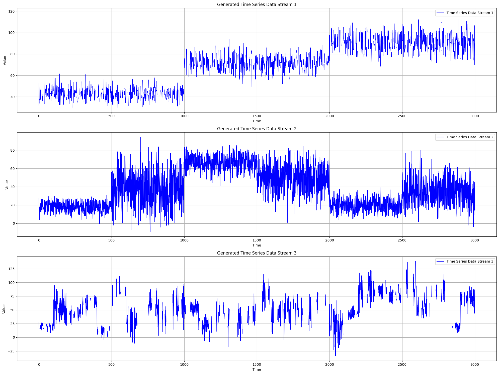

Data Streams Generator
======================

This module contains the class for generating multiple synthetic data streams with various change points.

Multiple Streams Generator Class
--------------------------------

.. autoclass:: source.generator.ds_generator.MultiDataStreams
   :members:
   :undoc-members:
   :show-inheritance:
   :special-members: __init__

Example Usage
-------------

**Generate Multiple Data Streams**

* **Without Missing Data**

.. code-block:: python

   from source.generator.ds_generator import MultiDataStreams

    dict_streams = [
                    {"num_segments": 3,
                    "segment_length": 1000,
                    "change_point_type": "sudden_shift",
                        "seed": 2},
                    {"num_segments": 6,
                        "segment_length": 500,
                        "change_point_type": "sudden_shift",
                        "seed": 11}
                    ]

    many_data_streams = MultiDataStreams(dict_streams=dict_streams)
    many_data_streams.generate_data_streams()
    list_data_streams = many_data_streams.get_all_streams()
    many_data_streams.plot_all_streams()
    

   
* **With Missing Data**

.. code-block:: python

   from source.generator.ds_generator import MultiDataStreams

    dict_streams = [
                    {"num_segments": 3,
                    "segment_length": 1000,
                    "change_point_type": "sudden_shift",
                        "seed": 2},
                    {"num_segments": 6,
                        "segment_length": 500,
                        "change_point_type": "sudden_shift",
                        "seed": 11},
                    {"num_segments": 4,
                        "segment_length": 750,
                        "change_point_type": "gradual_drift",
                        "seed": 7}
                    ]

    dict_missing = [{"type": "point",  # Point missingness for the first stream
                     "percentage": 0.4},
                    None,  # No missing data for the second stream
                    {"type": "block",  # Block missingness for the third stream
                     "percentage": 0.3,
                     "min_block_size": 5,
                     "max_block_size": 20}
                    ]

    many_data_streams = MultiDataStreams(dict_streams=dict_streams)
    many_data_streams.generate_data_streams(dict_missing=dict_missing)
    list_data_streams = many_data_streams.get_all_streams()
    many_data_streams.plot_all_streams()

