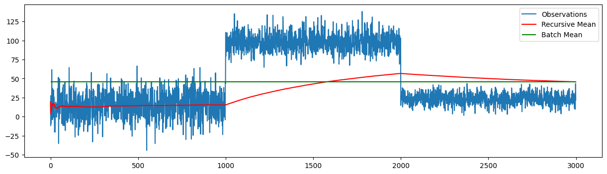

Recursive Average Filter
========================

The Recursive Average Filter is a simple yet effective technique used in signal processing and time series analysis to smooth out short-term fluctuations and highlight longer-term trends or cycles. It works by averaging the current data point with the previous average, thereby creating a smoothed version of the original signal.

Recursive Average Filter classes
---------------------------------

.. autoclass:: source.model.incremental.RecursiveAverage
   :members:
   :undoc-members:
   :show-inheritance:
   :special-members: __init__

Example Usage
-------------

.. code-block:: python

      import numpy as np
      import matplotlib.pyplot as plt
      from source.generator.change_point_generator import ChangePointGenerator
      from source.model.incremental import RecursiveAverage

      # Generate time series data with change points
      generator = ChangePointGenerator(num_segments=3, 
                                       segment_length=1000, 
                                       change_point_type='sudden_shift', 
                                       seed=12)  # set seed for reproducibility
      generator.generate_data()
      observations = generator.get_data()

      # create the model
      model = RecursiveAverage()
      list_means = []
      # update the model with each observation
      for observation in observations:
         model.update(observation)
         list_means.append(model.recursive_mean)

      # verify that the final recursive mean matches the batch mean
      round(model.recursive_mean, 3) == round(np.mean(observations),3)

      # plot the means: batch mean vs recursive mean
      plt.figure(figsize=(15, 4))
      plt.plot(observations, label='Observations')
      plt.plot(list_means, label='Recursive Mean', color='red')
      plt.hlines(np.mean(observations), 0, len(observations), colors='green', label='Batch Mean')
      plt.legend()
      plt.show()

**Plotting**

