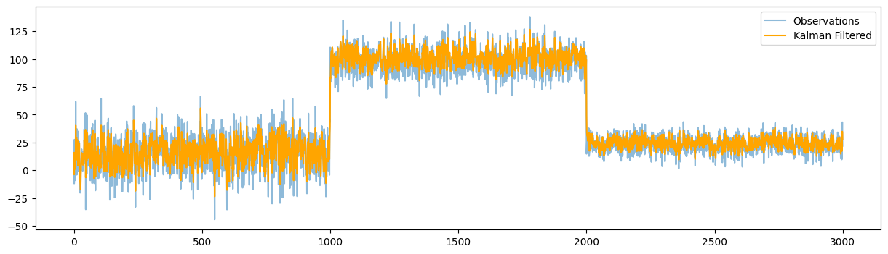

Kalman Filter
===============

The Kalman Filter is a recursive algorithm used for estimating the state of a dynamic system from a series of noisy measurements. It is widely used in various applications, including navigation, control systems, and signal processing. The filter operates in two main steps: prediction and update. In the prediction step, the filter estimates the current state based on the previous state and a model of the system's dynamics. In the update step, it incorporates new measurements to refine the estimate.

Kalman Filter class
-----------------------

.. autoclass:: source.smoother.incremental.KalmanFilter
   :members:
   :undoc-members:
   :show-inheritance:
   :special-members: __init__

Example Usage
-------------

.. code-block:: python

    import numpy as np
    import matplotlib.pyplot as plt
    from source.generator.change_point_generator import ChangePointGenerator
    from source.smoother.incremental import KalmanFilter

    # Generate time series data with change points
    generator = ChangePointGenerator(num_segments=3, 
                                      segment_length=1000, 
                                      change_point_type='sudden_shift', 
                                      seed=12)  # set seed for reproducibility
    generator.generate_data()
    observations = generator.get_data()

    # create the model
    F = np.array([[.8]])
    H = np.array([[.8]])
    Q = np.array([[.5]])
    R = np.array([[.5]])
    model = KalmanFilter(F=F, H=H, Q=Q, R=R)
    list_filtered = []
    # update the model with each observation
    for observation in observations:
        model.update(np.array([observation]))
        list_filtered.append(model.state_estimate)

    # plot the filtered values
    plt.figure(figsize=(15, 4))
    plt.plot(observations, label='Observations')
    plt.plot(list_filtered, label='Kalman Filtered', color='orange')
    plt.legend()
    plt.show()

**Plotting**

