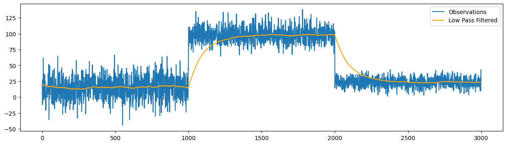

Low Pass Filter
================

The Low Pass Filter is a fundamental tool in signal processing used to remove high-frequency noise from a signal while preserving the low-frequency components. The filter is based on a recursive algorithm that continuously updates the filtered value based on the current input and the previous filtered value.

Low Pass Filter classes
-----------------------

.. autoclass:: source.smoother.incremental.LowPassFilter
   :members:
   :undoc-members:
   :show-inheritance:
   :special-members: __init__

Example Usage
-------------

.. code-block:: python

    import numpy as np
    import matplotlib.pyplot as plt
    from source.generator.change_point_generator import ChangePointGenerator
    from source.smoother.incremental import LowPassFilter

    # Generate time series data with change points
    generator = ChangePointGenerator(num_segments=3, 
                                    segment_length=1000, 
                                    change_point_type='sudden_shift', 
                                    seed=12)  # set seed for reproducibility
    generator.generate_data()
    observations = generator.get_data()

    # create the model
    model = LowPassFilter(alpha=0.99)
    list_filtered = []
    # update the model with each observation
    for observation in observations:
        model.update(observation)
        list_filtered.append(model.lowpass_mean)

    # plot the filtered values
    plt.figure(figsize=(15, 4))
    plt.plot(observations, label='Observations')
    plt.plot(list_filtered, label='Low Pass Filtered', color='orange')
    plt.legend()
    plt.show()

**Plotting**

