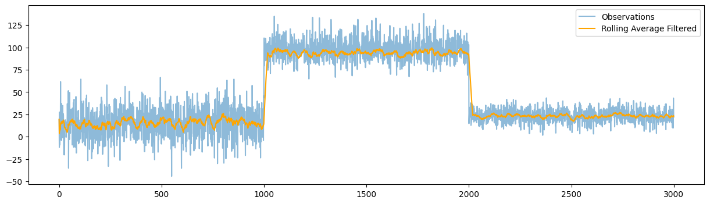

Rolling Average Filter
========================

The Rolling Average Filter is a simple yet effective technique for signal-processing and time series analysis to smooth out short-term fluctuations and highlight longer-term trends or cycles. It works by compinting the average over a rolling window of the most recent data points.

Recursive Average Filter classes
---------------------------------

.. autoclass:: source.smoother.incremental.RollingAverageFilter
   :members:
   :undoc-members:
   :show-inheritance:
   :special-members: __init__

Example Usage
-------------

.. code-block:: python

      import numpy as np
      import matplotlib.pyplot as plt
      from source.generator.change_point_generator import ChangePointGenerator
      from source.smoother.incremental import RollingAverageFilter

      # Generate time series data with change points
      generator = ChangePointGenerator(num_segments=3, 
                                       segment_length=1000, 
                                       change_point_type='sudden_shift', 
                                       seed=12)  # set seed for reproducibility
      generator.generate_data()
      observations = generator.get_data()

      model = RollingAverageFilter(window=20)

      # create the model
      model = RollingAverageFilter(window=50)
      list_roll_means = []
      # update the model with each observation
      for observation in observations:
         model.update(observation)
         list_roll_means.append(model.moving_mean)

   
      # plot the means: batch mean vs recursive mean
      plt.figure(figsize=(15, 4))
      plt.plot(observations, label='Observations', alpha=0.5)
      plt.plot(list_roll_means, label='Rolling Moving Average', color='orange')
      plt.legend()
      plt.show()

**Plotting**

